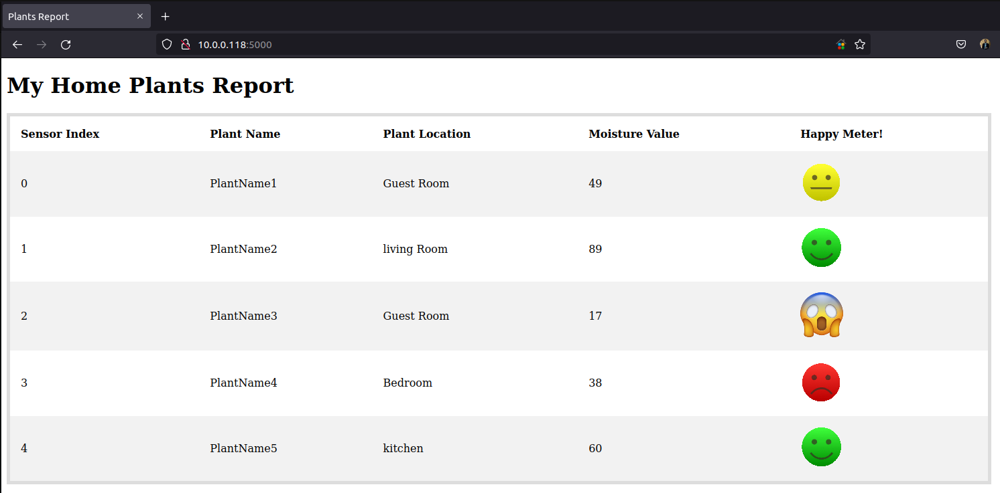
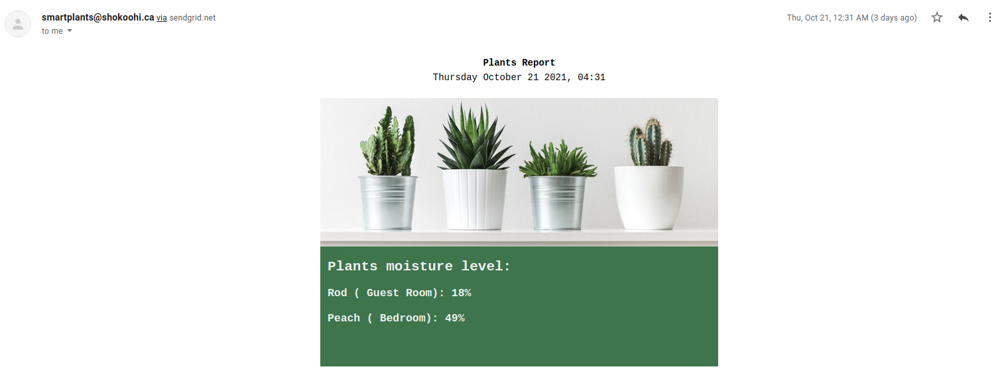

# My Smart Plants

`My Smart Plants` helps you to keep track of your plants' moisture level and send you notifications when the level goes under a certain value.
This application has two functionalities at this time: 

1. `Webapp`: Gives you live status of the plants' moisture level
2. `Reporter`: Check moisture levels and send notifications to you. At this time sending emails has been implemented using `SendGrid` service.


# Requirements

## Hardware Requirements

1. Arduino Uno (https://store.arduino.cc)
2. Capacitive Soil Moisture Sensor Module for Arduino (https://www.amazon.ca/Hacbop-Capacitive-Moisture-Corrosion-Resistant/dp/B097BMJB5V)
3. Breadboard and Jumper wires (when you want to expand your project to more than one sensor)
4. RaspberryPi or a Laptop (RaspberryPi is recommended because of low energy consumption)

## Software Requirements
1. Arduino IDE (https://www.arduino.cc/en/software)
2. Python3.6.x
3. Docker (if you want to execute in isolated environment)
4. Linux OS (Can use macOS and Windows in case of using Docker)


## Hardware Installation
1. Using jumper wires connect the Ground `GND` (black wire) of sensor to `GND` pin on Arduino
2. Using jumper wires connect the Power `VCC` (red wire) of sensor to `VCC` (Operating Voltage) pin on Arduino
3. Using jumper wires connect the Analog output `AOUT` (yellow wire) of sensor to one of the Analog inputs on Arduino (A0-A5)
4. You can use the Breadboard and more jumper wires to connect more sensors (up to 6) to the Arduino board. If you are not familiar with it watch this: https://www.youtube.com/watch?v=6WReFkfrUIk
 
## Software Installation
1. Connect the Arduino board with provided USB cable to your PC/Laptop where you installed Arduino IDE
2. Open Arduino IDE (Probably you need to execute as root or superuser to be able to access to the port)
    ``
    $ sudo ./ardiono
    ``
3. Select `Arduino Uno` from `Tools` menu `Boards` dropdown
4. Copy and paste the code in `arduino_code/read_sensors.ino` into the Arduino IDE. Modify the code based on the number of sensors you are connected to the board. For example the code for 2 sensors would be like this:

```
void setup()
{
  Serial.begin(9600);
}

void loop()
{
  int sensorVal0 = analogRead(A0);
  int sensorVal1 = analogRead(A1);

  Serial.print("{'0': ");
  Serial.print(sensorVal0);
  Serial.print(",'1': ");
  Serial.print(sensorVal1);
  Serial.println("}");

  delay(1000);
}

```

5. Click on verify and then upload your code to the board. Check the serial output by checking `Serial Monitor` in Tools Menu. The outputs should be like:

```
{'0': <value>, '1': <value>}
```

If you get the same format on output, you are good to go. Close the IDE and connect the board to the machine or Raspberry Pi device which runs the project all the time.

6. Clone this project or download the source code and extract it on the running machine. 


## Configure the project

To configure the project modify the `config.ini` based on the followings:

1. `from_email` and `to_email`: the emails you want to use as the sender and receiver. Don't make them blank or delete them even if you don't use the email module.
2. `dry`: Average of sensors' returned values when they are dry and outside the soil  
3. `wet`: Average of sensors' returned values when they are inside a glass of water
4. `moisture_alarm`: Notifications send when the moisture percentage goes under this value. Should be between 1 and 100.
5. `minutes`: The Reporter application check the plants status based on this interval and send notification for those plants with moisture level less than `moisture_alarm`

### Add and modify plants list
Open `plants.csv` file and add, modify or delete the plants with their sensor index. For example:

```csv
index, name, location
0, Rose, Living Room
1, Aglaonema, Guest Room
```

## Run the application

### Run the apps directly in shell
1. Create and activate a Python virtualenv for this project:

```
$ virtualenv -p python3.6 .venv
$ source .venv/bin/activate
```
Please note this project tested and ran successfully with Python 3.6.x, however it may works fine with newer versions if the requirements can be installed as well.

2. Install the requirements:

```bash
$ pip install -r requirements.txt
```

3. To run webapp: ``$ python app.py``
4. To run reporter (in another shell which the venv in activated): ``$ python reporter.py``

Please note if you want to use email notification, you need to create a free account on SendGrid (https://sendgrid.com), generate an API_Key there and store it in your code as bellow before executing the `reporter` module.

Check here to know how to do that: https://docs.sendgrid.com/ui/account-and-settings/api-keys


```
$ echo "export SENDGRID_API_KEY='YOUR_API_KEY'" > sendgrid.env
$ source ./sendgrid.env
```

### Run the apps using Docker
Docker enables developers to package applications into containers which helps to run the code in any environment. It's recommended to use Docker for this project since it can be run alongside other apps on your device without affecting them and will be auto-restart in case of any failure on Hardware and Software system.

1. Installing Docker: To use Docker first you need to install and enable its service on your device. Use this manual to setup Docker on your machine:
https://docs.docker.com/get-docker

2. Build the Docker image: Run the following command from the project path to build the Docker image:

``
$ ./run.sh build
``

3. Run the `Webapp` by executing: ``$ ./run.sh start-webapp``. CTRL+Click the provided url to see open the app in your default browser.
4. Run the `Reporter` by executing: ``$ ./run.sh start-reporter``. Please note you need to have `sendgrid` api_key and export it as described above.
5. To stop the apps execute: ``$ ./run.sh stop``


## Development and Participation
This app is on its early development stage and more features are planned to be added. Please feel free if you like to participate with this project by testing and submitting your Merge/Pull Requests.


### ToDos

* Calibrating sensors
* implementing database for configs, plants and readings
* CRUD plants via API and Webapp
* Individual plants reports for webapp
* Visualize moisture level for webapp
* Homepage for webapp
* Edit configs via Webapp 
* Implement wireless serial transceiver for Arduino 


## Screenshots:

### Webapp


### Email



## License

Distributed under the terms of the MIT license, "My Smart Plants" is free and open source software.